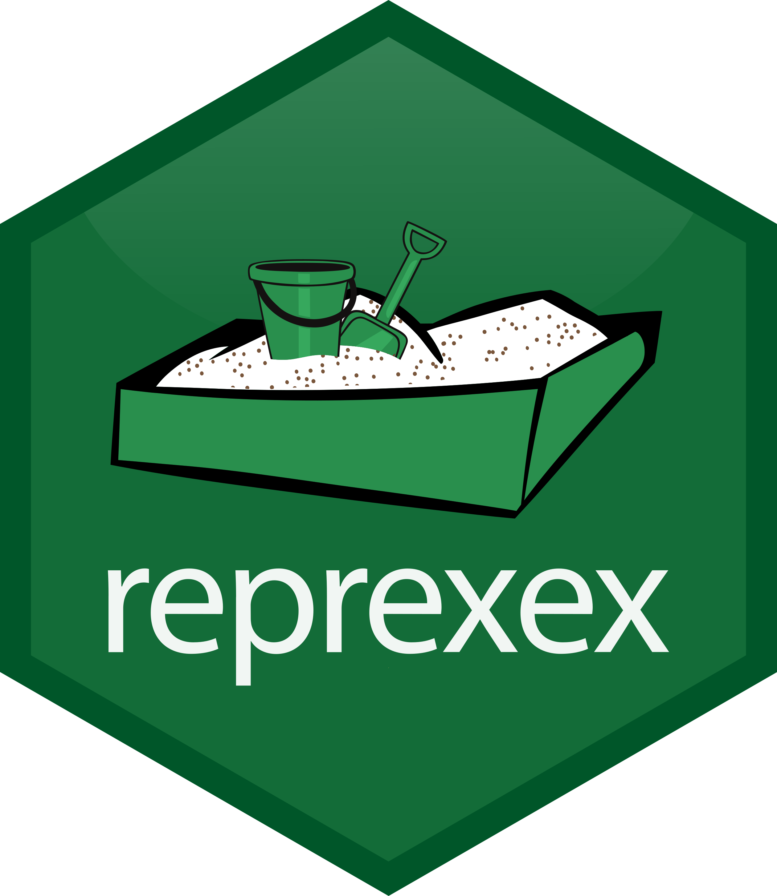

<!-- README.md is generated from README.Rmd. Please edit that file -->

```{r, include = FALSE}
knitr::opts_chunk$set(
  collapse = TRUE,
  comment = "#>",
  fig.path = "man/figures/README-",
  out.width = "100%",
  eval = FALSE
)
```

# `r params$package` 

<!-- badges: start -->
`r badger::badge_repostatus("WIP")`
`r badger::badge_lifecycle("experimental")`
`r badger::badge_last_commit(branch = "main")`
`r badger::badge_license()`
<br />
`r badger::badge_github_actions(action = "Style")`
`r badger::badge_github_actions(action = "lint")`
`r badger::badge_github_actions(action = "test-coverage")`
`r badger::badge_codecov()`
`r badger::badge_github_actions(action = "R-CMD-check")`
<!-- badges: end -->

## Overview

The goal of ``r params$package`` is to provide additional functionality for the [{reprex}](https://cran.r-project.org/package=reprex) package.

<br />

## Installation

You can install ``r params$package`` from [GitHub](https://github.com/`r params$github`/`r params$package`) with:

```r
pak::pkg_install("`r params$github`/`r params$package`")
```

If necessary `pak` can be installed with:

```r
install.packages("pak", repos = sprintf("https://r-lib.github.io/p/pak/stable/%s/%s/%s", .Platform$pkgType, R.Version()$os, R.Version()$arch))
```

<br />

## Code of Conduct

Please note that the `r params$package` project is released with a [Contributor Code of Conduct](https://contributor-covenant.org/version/2/0/CODE_OF_CONDUCT.html). By contributing to this project, you agree to abide by its terms.

<br />

## Code Style

This package attempts to follow the [tidyverse style guide](https://style.tidyverse.org/index.html).

The use of [{styler}](https://github.com/r-lib/styler) and [{lintr}](https://github.com/r-lib/lintr) are recommended.
