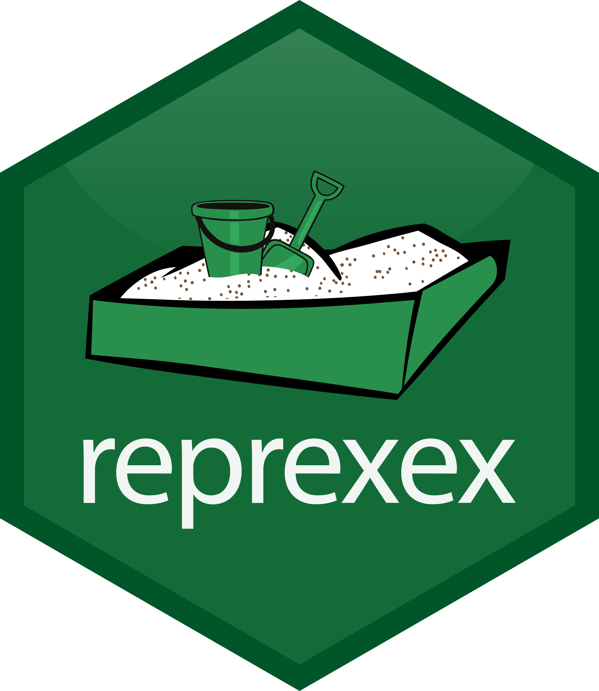

<!-- README.md is generated from README.Rmd. Please edit that file -->

# reprexex 

<!-- badges: start -->

[](https://www.repostatus.org/#wip)
[](https://lifecycle.r-lib.org/articles/stages.html#experimental)
[](https://github.com/the-mad-statter/reprexex/commits/main)
[-blue.svg)](https://cran.r-project.org/web/licenses/GPL%20(%3E=%203))
<br />

<!-- badges: end -->

## Overview

The goal of `reprexex` is to provide additional functionality for the
{reprex} package.

<br />

## Installation

You can install `reprexex` from
[GitHub](https://github.com/the-mad-statter/reprexex) with:

``` r
pak::pkg_install("the-mad-statter/reprexex")
```

If necessary `pak` can be installed with:

``` r
install.packages("pak", repos = sprintf("https://r-lib.github.io/p/pak/stable/%s/%s/%s", .Platform$pkgType, R.Version()$os, R.Version()$arch))
```

<br />

## Code of Conduct

Please note that the reprexex project is released with a [Contributor
Code of
Conduct](https://contributor-covenant.org/version/2/0/CODE_OF_CONDUCT.html).
By contributing to this project, you agree to abide by its terms.

<br />

## Code Style

This package attempts to follow the [tidyverse style
guide](https://style.tidyverse.org/index.html).

The use of [{styler}](https://github.com/r-lib/styler) and
[{lintr}](https://github.com/r-lib/lintr) are recommended.
